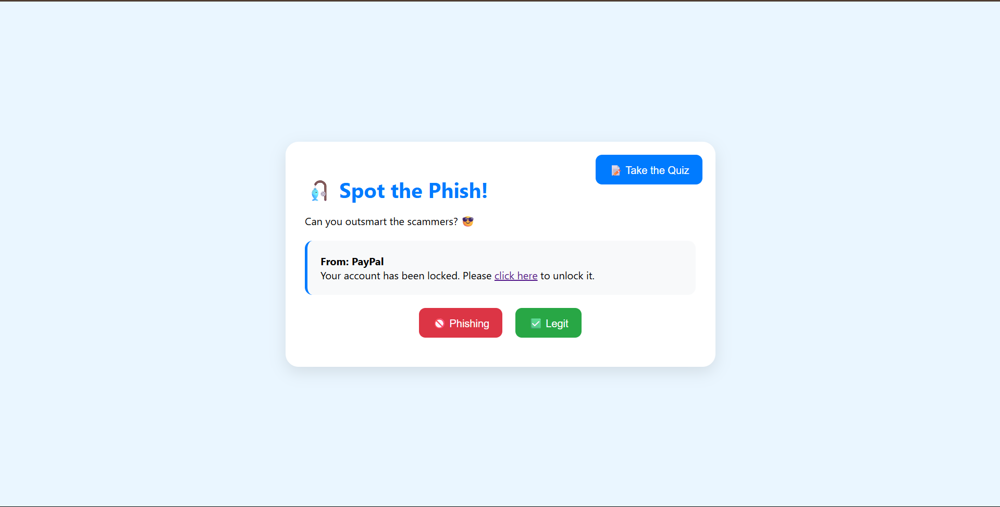
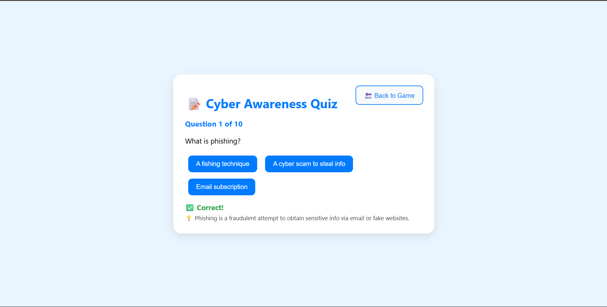

# 🛡️ Cyber Awareness Game & Quiz 🎣

An interactive and friendly web game designed to help users recognize phishing emails, followed by a short quiz to reinforce key cybersecurity concepts.

## 🎮 Features

- ✅ Spot the Phish game (phishing vs. legit emails)
- ✅ Sound & animation feedback
- ✅ Confetti celebration when answers are correct
- ✅ Multiple-choice Cyber Awareness Quiz
- ✅ Score tracking & pass/fail logic
- ✅ Mobile-friendly and easy-to-use UI

## 📸 Screenshots

| Game Screen | Quiz Screen |
|-------------|--------------|
|  |  |

## 🚀 How to Use

1. Click **Start** on the game.
2. Review each email and decide if it's phishing or legit.
3. After the game, take the quiz.
4. Get instant feedback, score, and a fun celebration if you pass!

## 📁 Files

- `index.html` – Game interface
- `quiz.html` – Quiz interface
- `sonido-correcto-331225.mp3` – Correct answer sound
- `incorrect-293358.mp3` – Incorrect answer sound

## 📦 How to Run

Just open `index.html` in your browser. No server needed.

Or try it live on GitHub Pages:  
👉 **[Play Now](https://YOUR_USERNAME.github.io/cyber-awareness-game)**

## 🧠 Target Audience

This tool was created to raise awareness in a fun and visual way for:
- Students
- Employees
- Everyday users online

## 📄 License

MIT – free to use, remix, and improve. Spread awareness, not scams.
